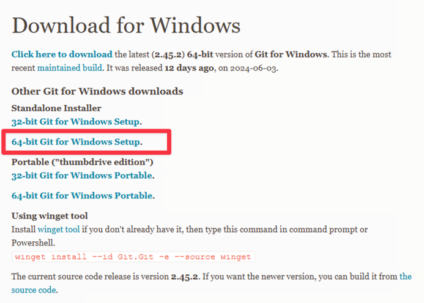
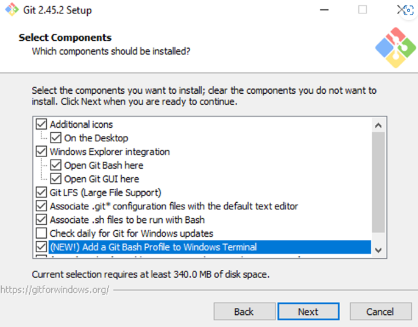
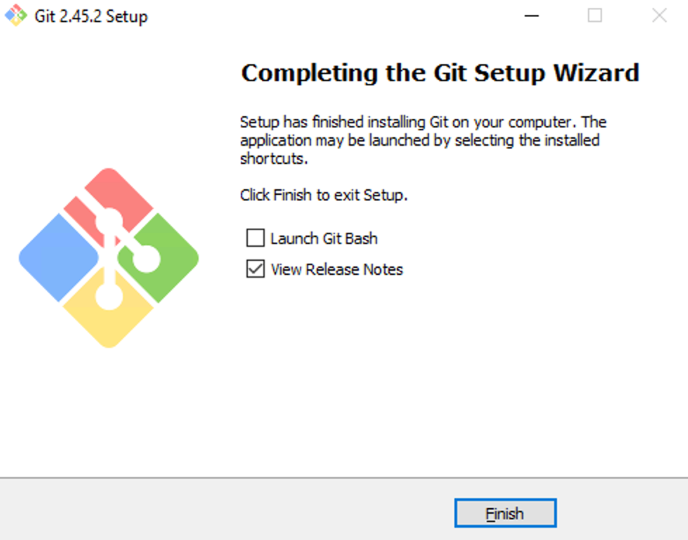
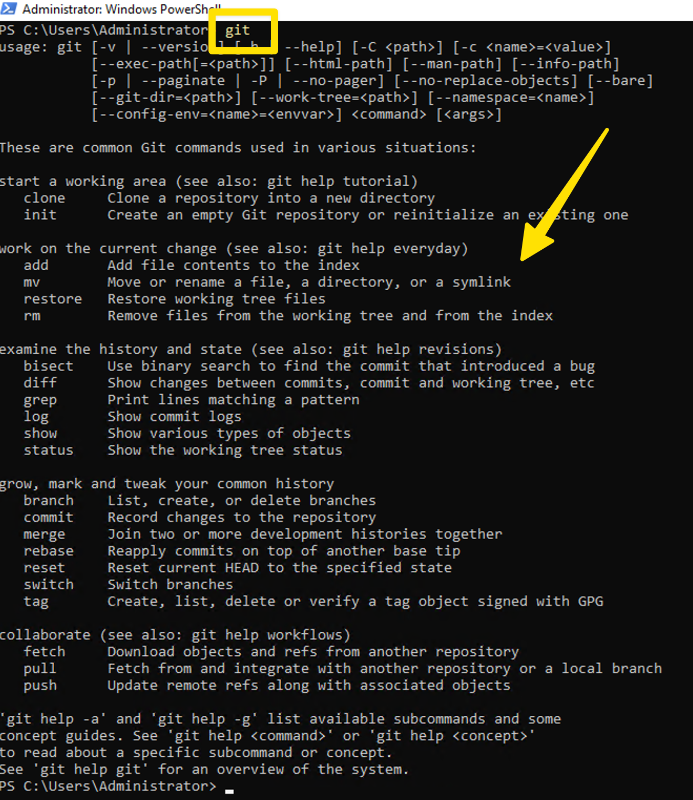
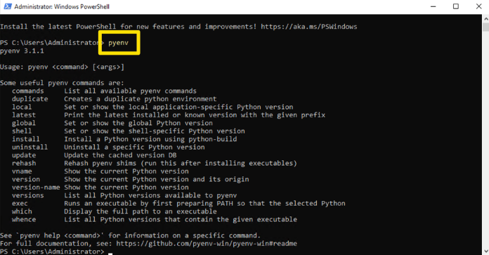
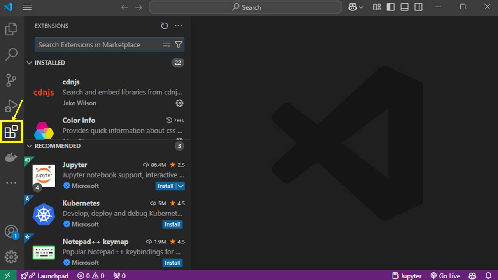
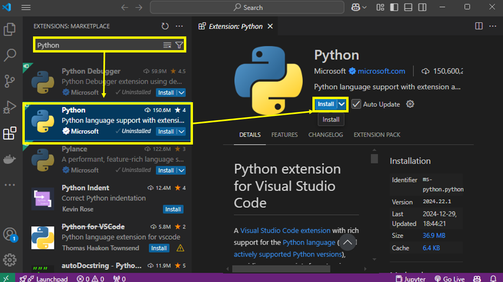
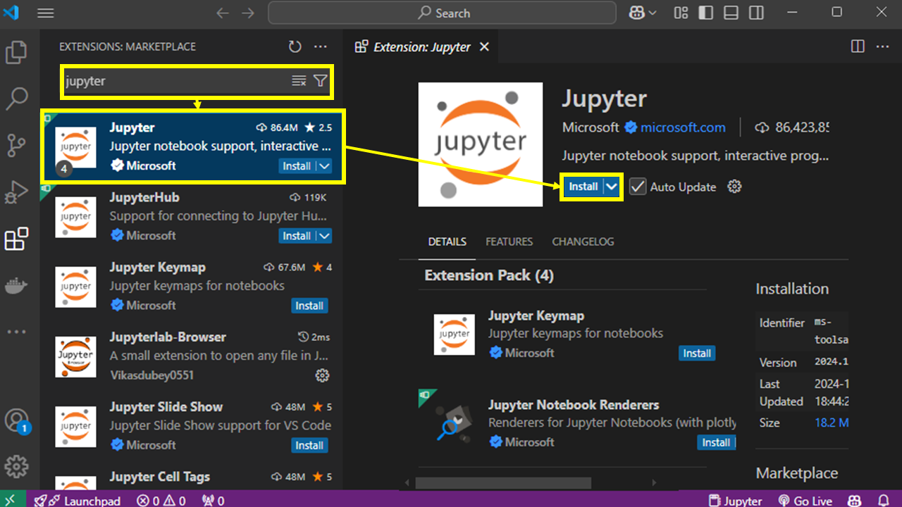

# Windows安装入门

- 作者: [Wooseok-Jeong](https://github.com/jeong-wooseok)
- 评审: [Yun Eun](https://github.com/yuneun92), [MinJi Kang](https://www.linkedin.com/in/minji-kang-995b32230/)
- 校对 : [Q0211](https://github.com/Q0211)
- 本内容是 [LangChain Open Tutorial](https://github.com/LangChain-OpenTutorial/LangChain-OpenTutorial) 的一部分

<Card title="打开Colab" href="https://colab.research.google.com/github/LangChain-OpenTutorial/LangChain-OpenTutorial/blob/main/01-Basic/01-Getting-Started-Windows.ipynb" img="https://colab.research.google.com/assets/colab-badge.svg">
  
</Card>

<Card title="打开github" href="https://github.com/LangChain-OpenTutorial/LangChain-OpenTutorial/blob/main/01-Basic/01-Getting-Started-Windows.ipynb" img="https://img.shields.io/badge/Open%20in%20GitHub-181717?style=flat-square&logo=github&logoColor=white">
  
</Card>

## 概述

本教程将详细介绍如何在 Windows 环境下安装 LangChain 包。您可以通过克隆所需的 GitHub 仓库、通过 pyenv 和 Poetry 批量安装与作者相同的软件包、安装 Visual Studio Code 及 Jupyter 扩展，轻松搭建开发环境。

### 目录

- [概述](#概述)
- [安装 git](#安装git)
- [安装 pyenv](#安装pyenv)
- [安装 Poetry](#安装Poetry)
- [安装 Visual Studio Code](#安装Visual Studio Code)
- [安装 Jupyter Extension](#安装Jupyter Extension)

### 下载链接

- [下载git](https://git-scm.com/download/win)
- [下载Visual Studio Code](https://code.visualstudio.com/download)

---

## 安装git

[下载git](https://git-scm.com/download/win)

Download 64-bit Git for Windows Setup



按照安装步骤确认并继续



Click the Next button for all the rest to proceed with the installation.



Window key - PowerShell must be run as administrator

Enter the command "`git`" and verify that the output looks like the image below

```powershell
git
```



- Apply PowerShell Policy

First, run **Windows PowerShell** as an "administrator".

Enter the following command to apply the policy

```powershell
Set-ExecutionPolicy RemoteSigned -Scope CurrentUser -Force
```

After the application is complete, turn Windows PowerShell off and then on. For the purposes of the following, "Run as administrator" when running Windows PowerShell.

## 安装pyenv

Install pyenv before installing python. pyenv installs a virtualization environment to prevent conflicts between packages.

```bash
git clone https://github.com/pyenv-win/pyenv-win.git "$env:USERPROFILE\.pyenv"
```

- Add environment variables

Copy and paste the content below and run it

```powershell
[System.Environment]::SetEnvironmentVariable('PYENV', $env:USERPROFILE + "\.pyenv\pyenv-win\", "User")
[System.Environment]::SetEnvironmentVariable('PYENV_ROOT', $env:USERPROFILE + "\.pyenv\pyenv-win\", "User")
[System.Environment]::SetEnvironmentVariable('PYENV_HOME', $env:USERPROFILE + "\.pyenv\pyenv-win\", "User")
```

Copy and paste the content below and run it

```powershell
[System.Environment]::SetEnvironmentVariable('PATH', $env:USERPROFILE + "\.pyenv\pyenv-win\bin;" + $env:USERPROFILE + "\.pyenv\pyenv-win\shims;" + [System.Environment]::GetEnvironmentVariable('PATH', "User"), "User")
```

Shut down and rerun the current Windows PowerShell.

Enter the following command to verify that it works.

```powershell
pyenv
```



- 安装 python

安装 Python 3.11

```powershell
pyenv install 3.11
```

将 Python 3.11 设置为默认运行时环境。

```powershell
pyenv global 3.11
```

检查 Python 版本

```powershell
python --version
```

请确保您已安装 3.11.9 版本（安装 3.11.11 版本亦可！）。

## 安装 Poetry

Run the command below to install the Poetry package management tool.

```bash
pip3 install poetry
```

- [Link to LangChain-OpenTutorial.git](https://github.com/LangChain-OpenTutorial/LangChain-OpenTutorial.git)

Navigate to the Documents folder.

```powershell
cd ~/Documents
```

Execute the command below to get the source code.

```powershell
git clone https://github.com/LangChain-OpenTutorial/LangChain-OpenTutorial.git
```

Execute the command below to navigate to the LangChain-OpenTutorial directory.

```powershell
cd LangChain-OpenTutorial
```

Setting up a Python virtual environment

```powershell
poetry shell
```

Batch update Python packages

```powershell
poetry update
```

## Install Visual Studio Code

Download Visual Studio Code

- [Download Visual Studio Code](https://code.visualstudio.com/download)

Install the downloaded Visual Studio Code (copy it to the Applications folder)

Click 'install' of Jupyter on left Menu of extensions



## Install Jupyter Extension

Search for "python" and install



Search for "jupyter" and install



Turn off and restart Visual Studio Code

The installation is complete, and you can click the "select kernel" button in the top right corner.

Click python environment - if you don't see the virtual environment you installed, turn off Visual Studio Code and restart it