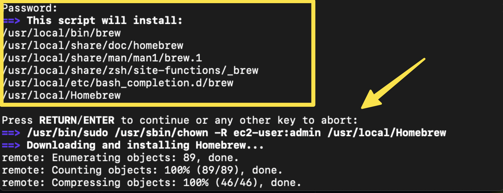
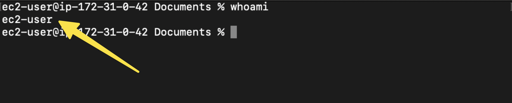
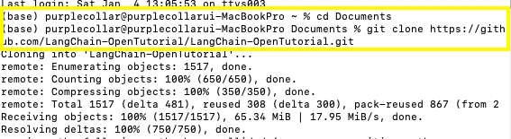

# Mac安装入门

- 翻译：[xiaoshun007](https://github.com/xiaoshun007)
- 作者: [JeongHo Shin](https://github.com/ThePurpleCollar)
- 评审: [JeongGi Park](https://www.linkedin.com/in/jeonggipark/), [Wooseok Jeong](https://github.com/jeong-wooseok)
- 校对 : [Q0211](https://github.com/Q0211)
- 本内容是 [LangChain Open Tutorial](https://github.com/LangChain-OpenTutorial/LangChain-OpenTutorial) 的一部分

<Card title="打开Colab" href="https://colab.research.google.com/github/LangChain-OpenTutorial/LangChain-OpenTutorial/blob/main/01-Basic/02-Getting-Started-Mac.ipynb" img="https://colab.research.google.com/assets/colab-badge.svg">
  
</Card>

<Card title="打开github" href="https://github.com/LangChain-OpenTutorial/LangChain-OpenTutorial/blob/main/01-Basic/02-Getting-Started-Mac.ipynb" img="https://img.shields.io/badge/Open%20in%20GitHub-181717?style=flat-square&logo=github&logoColor=white">
  
</Card>

## 概述

本指南针对在Mac系统上使用LangChain进行开发，提供了一套完整的配置流程。LangChain作为基于大语言模型（LLM）的应用程序开发框架，通过本指南可确保您的开发环境获得全面优化，实现无缝集成与高效开发。

# 目录

- [概述](#概述)
- [打开终端](#打开终端)
- [安装 Homebrew](#安装-Homebrew)
- [检查Xcode安装情况](#检查Xcode安装情况)
- [下载练习代码](#下载练习代码)
- [Python 和环境配置](#安装-Pyenv)
- [开发工具设置](#安装-Visual-Studio-Code)

----

## 打开终端
- 按下 Command + 空格键 打开聚焦搜索。

- 搜索 **terminal** 然后按回车键打开终端。

## 安装 Homebrew

### 运行Homebrew安装命令
- 在终端中运行以下命令以安装Homebrew：

   ```bash
   /bin/bash -c "$(curl -fsSL https://raw.githubusercontent.com/Homebrew/install/HEAD/install.sh)"
   ```

- 系统提示时请输入账户密码。

     
- 按回车键继续安装。

### 配置 Homebrew 环境

- 运行以下命令以检查您的用户名：
   ```bash
   whoami
   ```


- 检查Homebrew的安装路径：
   ```bash
   which brew
   ```

- 检查Homebrew的安装路径：
   - **Case 1** : 若输出结果为 **/opt/homebrew/bin/brew**，请使用以下命令配置环境：
      ```bash
      echo 'eval "$(/opt/homebrew/bin/brew shellenv)"' >> /Users/<your-username>/.zprofile
      ```

   - **Case 2** : 若输出结果为 **/usr/local/bin/brew**，请使用以下命令：
      ```bash
      echo 'eval "$(/usr/local/bin/brew shellenv)"' >> /Users/<your-username>/.zprofile
      ```

## 检查Xcode安装情况

要检查是否已安装Xcode命令行工具，请在终端中运行以下命令：


```bash
xcode-select --install
```


## 下载练习代码

[Reference] 练习代码位置: [LangChain 练习代码](https://github.com/LangChain-OpenTutorial/LangChain-OpenTutorial)


### 检查Git安装状态

- 要检查Git是否已安装，请在终端中运行以下命令：
   ```bash
   git --version
   ```

- 若命令显示Git版本号，说明已成功安装Git，无需额外操作。

- 若未检测到Git，可通过Homebrew进行安装：
   ```bash
   brew install git
   ```

- 安装完成后，请重新验证Git：
   ```bash
   git --version
   ```


### 使用Git下载练习代码
- 进入 **Documents** 文件夹（或您想要下载练习代码的其他任意目录），并使用以下命令：
   ```bash
   cd Documents
   ```
- 若需使用其他目录，请将 Documents 替换为指定路径。

- 使用 **git** 命令从代码仓库下载练习代码，请在终端中运行以下命令：
   ```bash
   git clone https://github.com/LangChain-OpenTutorial/LangChain-OpenTutorial.git
   ```


- 代码库将被克隆到当前目录下的 LangChain-OpenTutorial 文件夹中。


## 安装 Pyenv

#### 引用
详细文档请参阅 [Pyenv GitHub 页面](https://github.com/pyenv/pyenv?tab=readme-ov-file#understanding-python-version-selection).

---

#### 安装Pyenv的步骤

1. 更新Homebrew并通过以下命令安装 ```pyenv```：
   ```bash
   brew update
   brew install pyenv
   ```

2. 将以下内容添加到 ~/.zshrc 文件中。请将下列命令复制并粘贴到终端：
   ```bash
   echo 'export PYENV_ROOT="$HOME/.pyenv"' >> ~/.zshrc
   echo '[[ -d $PYENV_ROOT/bin ]] && export PATH="$PYENV_ROOT/bin:$PATH"' >> ~/.zshrc
   echo 'eval "$(pyenv init -)"' >> ~/.zshrc
   ```

3. 若遇到权限错误，请运行以下命令进行修复：
   ```bash
   sudo chown $USER ~/.zshrc
   echo 'export PYENV_ROOT="$HOME/.pyenv"' >> ~/.zshrc
   echo '[[ -d $PYENV_ROOT/bin ]] && export PATH="$PYENV_ROOT/bin:$PATH"' >> ~/.zshrc
   echo 'eval "$(pyenv init -)"' >> ~/.zshrc
   ```

4. 重启终端以使配置生效：
   ```bash
   exec "$SHELL"
   ```


## 安装 Python

- 使用 ```pyenv``` 来安装 Python 3.11:
   ```bash
   pyenv install 3.11
   ```

- 将Python 3.11设置为全局默认版本：
    ```bash
    pyenv global 3.11
    ```

- 重启Shell以使更改生效：
    ```bash
    exec zsh
    ```

- 验证已安装的Python版本：
    ```bash
    python --version
    ```

- 请确认输出结果显示为 3.11。

## 安装 Poetry

#### 链接
详细文档请参阅 [Poetry 官方文档](https://python-poetry.org/docs/#installing-with-the-official-installer).

---

#### 安装与配置Poetry的步骤

- 使用 ```pip3``` 安装 Poetry :
   ```bash
   pip3 install poetry
   ```

- 使用Poetry创建Python虚拟环境：
   ```bash
    poetry shell
    ```

- 更新项目中的所有Python依赖：
   ```bash
    poetry update
    ```


## 安装 Visual Studio Code

- **下载 Visual Studio Code**:
   - 访问 [Visual Studio Code Download Page](https://code.visualstudio.com/download)。
   - Download the installer for your operating system。

- **安装 Visual Studio Code**:
   - 请根据您的系统版本遵循对应安装指引。

   - 将应用程序拖拽至 **应用程序** 文件夹。

- **安装 扩展**:
   - 打开 Visual Studio Code。
   - 点击左侧边栏上的 **扩展** 图标。
   - 在扩展市场中搜索 **"python"** 并完成安装。
   - 在扩展市场中搜索 **"jupyter"** 并完成安装。

- **重启 Visual Studio Code**:
   - 安装扩展后，请重启Visual Studio Code以使更改生效。

- **选择Python环境**:
   - 点击Visual Studio Code右上角的 **"选择内核"**

   - 选择您之前设置的Python虚拟环境

   - **注意**：若您的环境未出现在列表中，请重启Visual Studio Code。

---

现在，Visual Studio Code已完成全面配置，可支持Python和Jupyter的集成开发环境。