- 翻译：[xiaoshun007](https://github.com/xiaoshun007)
- 作者: [Minji](https://github.com/r14minji)
- 评审: [Chang-Jun Lee](https://powersolution.notion.site/), [Wooseok Jeong](https://github.com/jeong-wooseok)
- 校对 : [Q0211](https://github.com/Q0211)
- 本内容是 [LangChain Open Tutorial](https://github.com/LangChain-OpenTutorial/LangChain-OpenTutorial) 的一部分

<Card title="打开Colab" href="https://colab.research.google.com/github/LangChain-OpenTutorial/LangChain-OpenTutorial/blob/main/01-Basic/03-OpenAIAPI-Key-Generation.ipynb" img="https://colab.research.google.com/assets/colab-badge.svg">
  
</Card>

<Card title="打开github" href="https://github.com/LangChain-OpenTutorial/LangChain-OpenTutorial/blob/main/01-Basic/03-OpenAIAPI-Key-Generation.ipynb" img="https://img.shields.io/badge/Open%20in%20GitHub-181717?style=flat-square&logo=github&logoColor=white">
  
</Card>

## 概述

本指南详细说明OpenAI API密钥的获取方式、使用规范及相关成本限制。

首先需要在OpenAI平台创建API密钥，并完成开发环境配置。

完成设置后，请对API密钥进行测试，以确保其能在应用程序中正常运行。

### 目录
- [概述](#概述)
- [OpenAI API支付与使用限额设置](#OpenAI-API支付与使用限额设置)
- [OpenAI API密钥生成指南](#OpenAI-API密钥生成指南)
- [环境配置](#环境配置)

----

## OpenAI API支付与使用限额设置


访问 OpenAI API 网站


- 访问: https://platform.openai.com/docs/overview

点击右上角的 **"注册"** 创建账户（若已有账户，请点击 **"登录"**）。

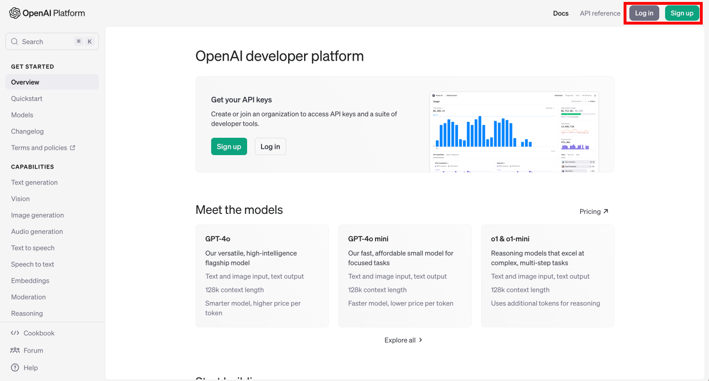

登录后，请点击右上角 **设置** 菜单并选择**"Billing"**选项

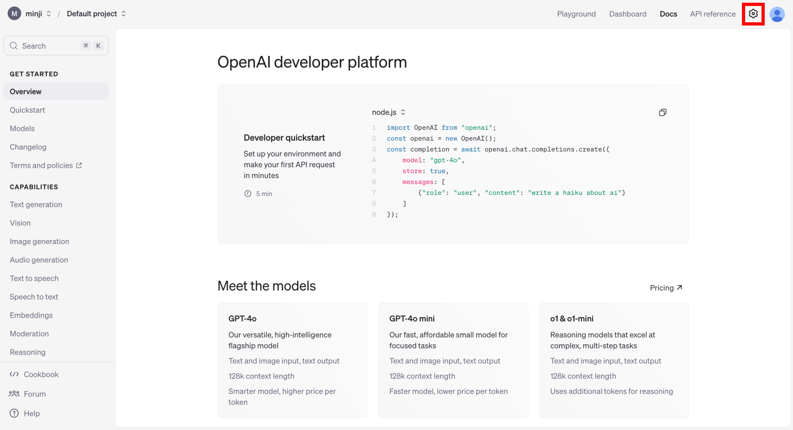

在左侧 **计费** 菜单中，点击 **付款方式** 完成信用卡绑定

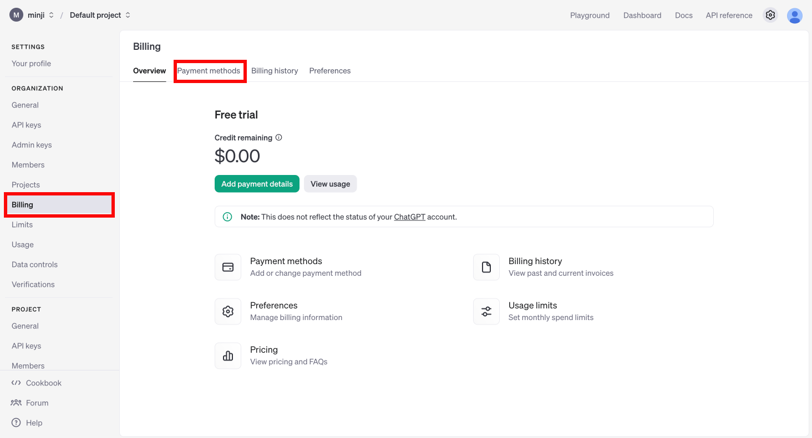

信用卡成功绑定后，将如下方图示显示在付款方式列表中。

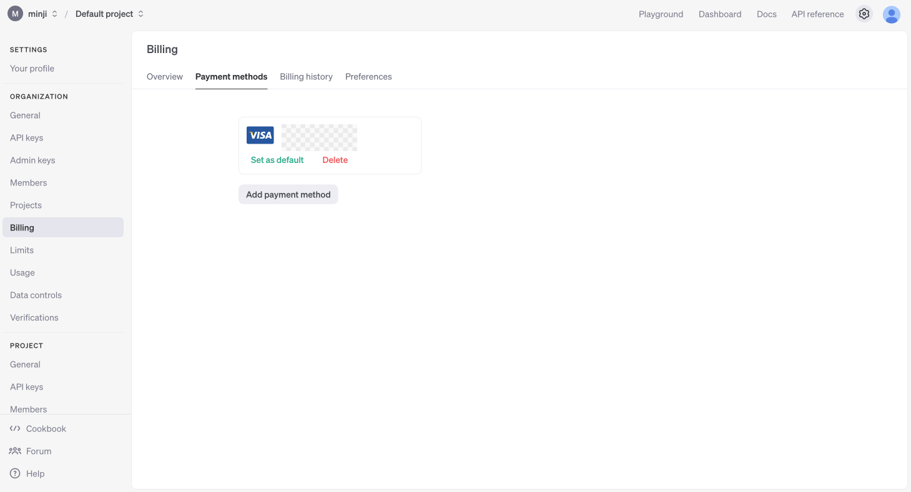

点击 **"充值余额"** 按钮，输入您要充值的美元金额。


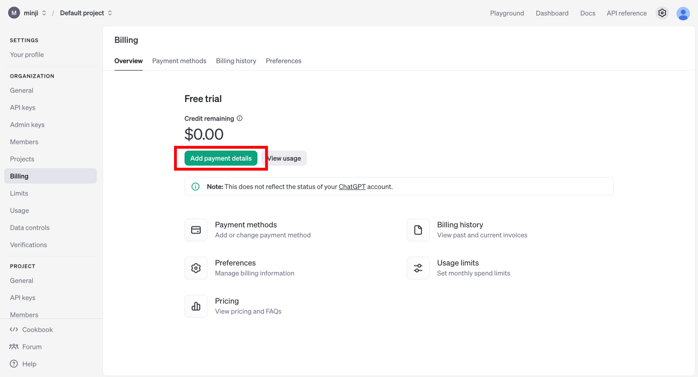


最低充值金额为 ```5美元```（即单次充值不得低于此金额）。

输入金额后，点击 **"继续"** 完成支付流程。

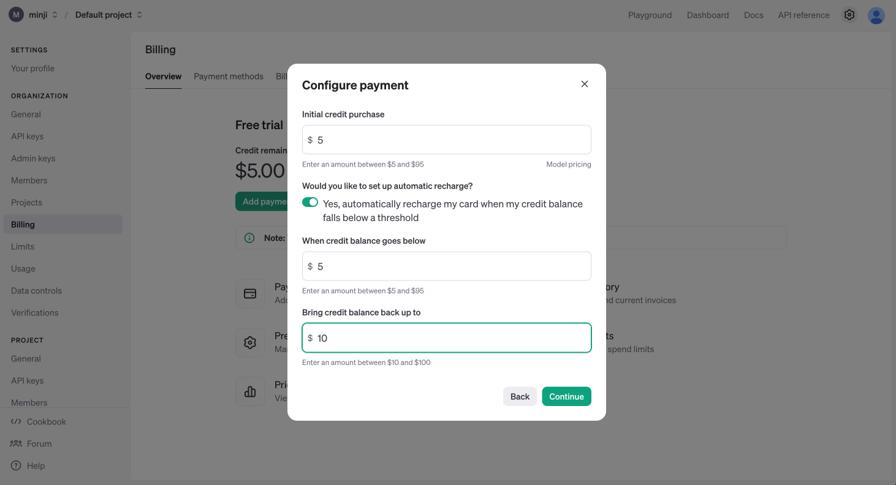

在左侧 **限额** 标签页中，您可以设置月度使用限制：

- **"设置月度预算"**：用于设定月度支出上限。达到该金额后系统将停止计费并中止API服务。

- **"设置邮件通知阈值"**：可指定触发邮件提醒的金额。当用量达到该阈值时，您将收到邮件通知。


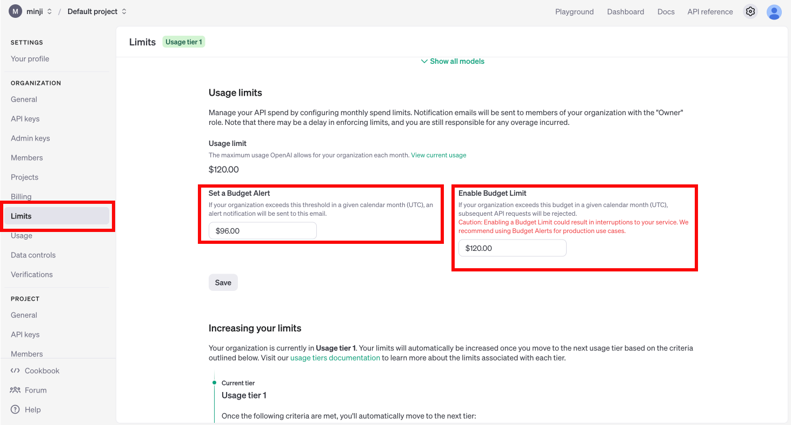

## OpenAI API密钥生成指南

点击右上角个人头像，然后选择 **"个人信息"**。

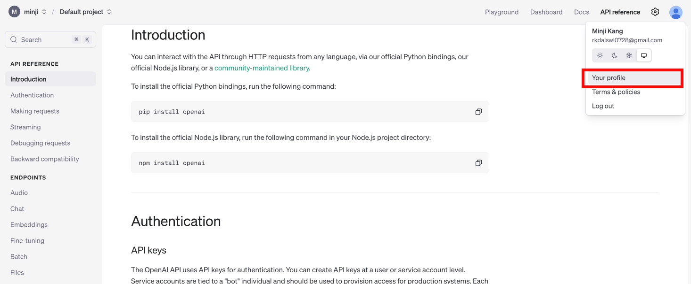

进入API密钥管理菜单

- 访问: https://platform.openai.com/api-keys


点击 **"创建新的密钥"**

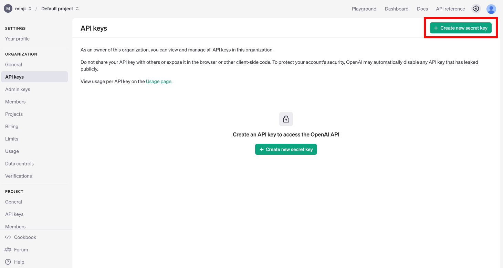

输入密钥名称并选择项目（若未创建过项目，请选择默认项目）

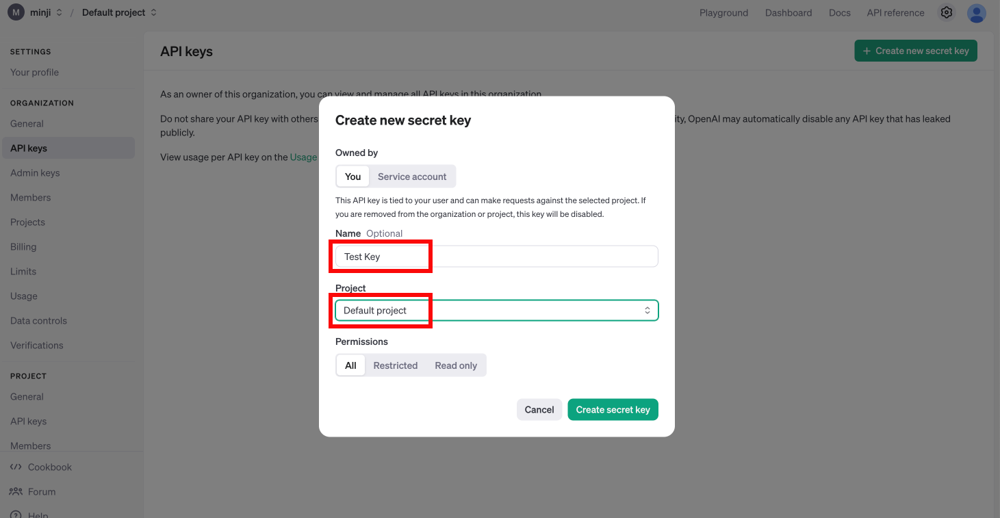

点击右侧 **"复制"** 按钮保存密钥。

**重要警告！！！**

若密钥泄露，他人可使用您的API密钥调用GPT服务，产生的费用将计入 **您的账户**。
**请勿与他人共享密钥，务必将其保存在安全位置！**（请将其视为密码妥善保管）

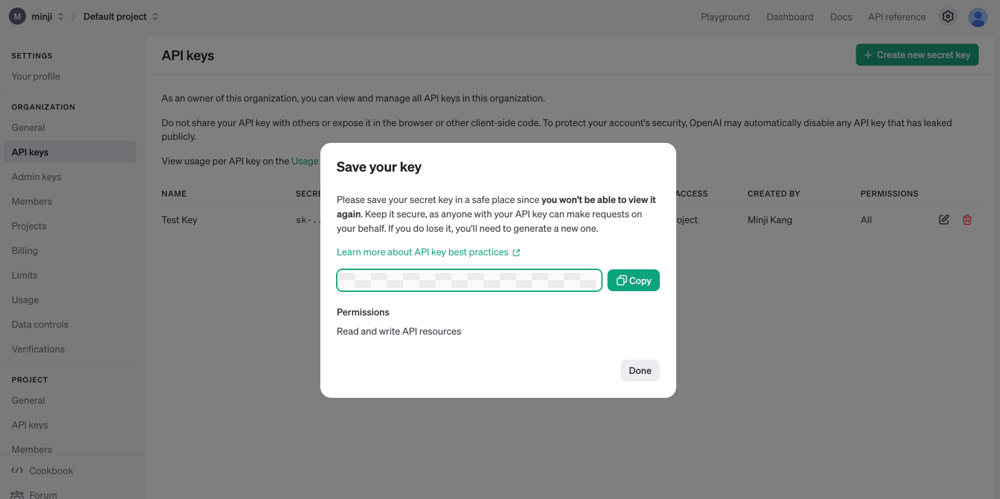


## 环境配置

配置 .env 文件

1. 在项目根目录下创建 ```.env``` 文件
2. 在文件中输入 ```OPENAI_API_KEY=复制的密钥```，按 Ctrl + S（Mac 用户使用 Command + S）保存并关闭文件

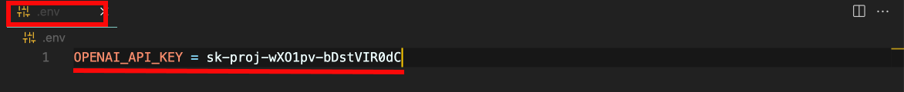

配置.gitignore文件

1. 在项目根目录创建 ```.gitignore``` 文件
2. 在文件中添加 ```.env``` 以避免该文件被Git追踪


```python
# 更新 LangChain
!pip install langchain-opentutorial
```

```python
# Configuration file to manage API KEY as environment variable
# Install: pip install python-dotenv
from dotenv import load_dotenv

# Load API KEY information
load_dotenv()
```

```python
True
```

现在来验证API密钥是否配置正确：

```python
import os
print(f"[API KEY]\n{os.environ['OPENAI_API_KEY']}")
```
