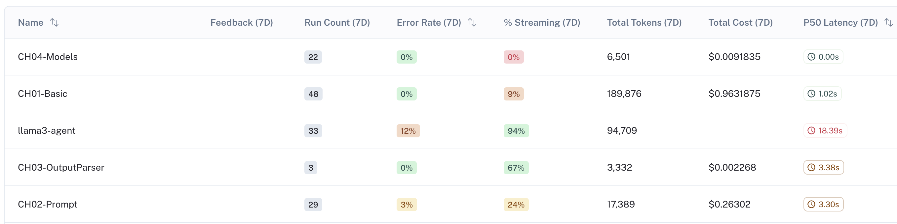
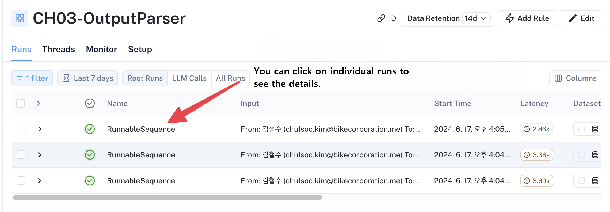
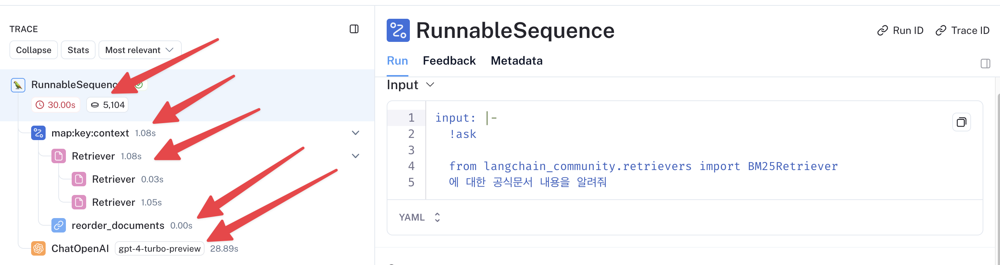
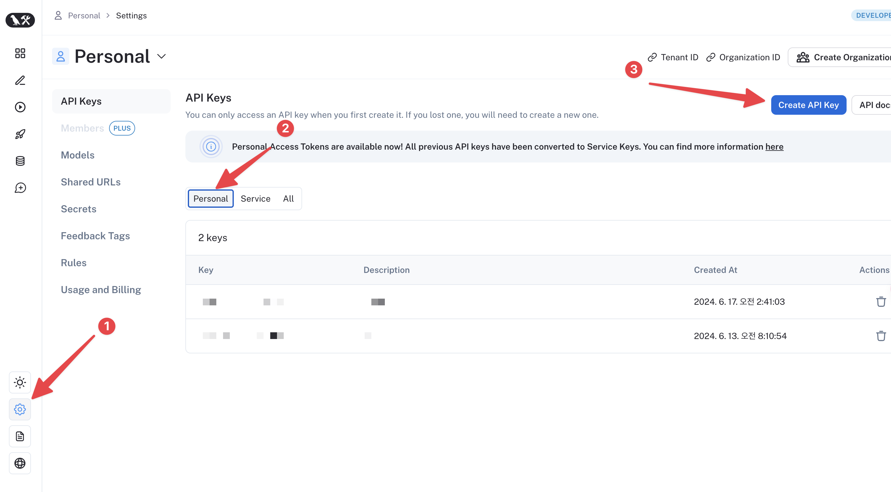
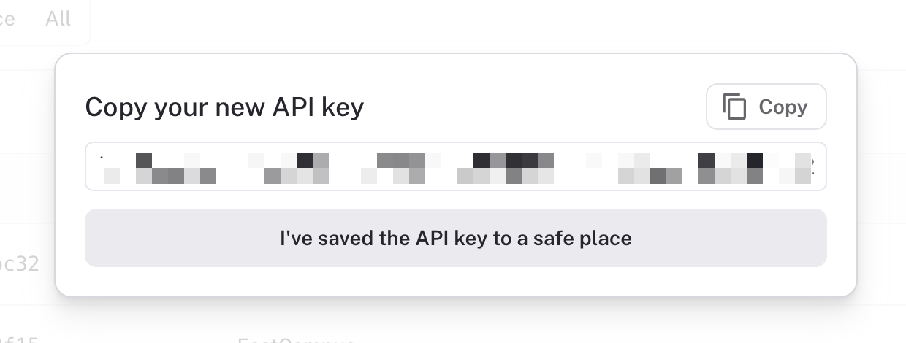
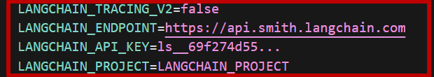

- 翻译：[xiaoshun007](https://github.com/xiaoshun007)
- 作者: [JeongGi Park](https://github.com/jeongkpa)
- 评审: [MinJi Kang](https://www.linkedin.com/in/minji-kang-995b32230/), [Wooseok Jeong](https://github.com/jeong-wooseok)
- 校对 : [Q0211](https://github.com/Q0211)
- 本内容是 [LangChain Open Tutorial](https://github.com/LangChain-OpenTutorial/LangChain-OpenTutorial) 的一部分

<Card title="打开Colab" href="https://colab.research.google.com/github/LangChain-OpenTutorial/LangChain-OpenTutorial/blob/main/01-Basic/04-LangSmith-Tracking-Setup.ipynb" img="https://colab.research.google.com/assets/colab-badge.svg">
  
</Card>

<Card title="打开github" href="https://github.com/LangChain-OpenTutorial/LangChain-OpenTutorial/blob/main/01-Basic/04-LangSmith-Tracking-Setup.ipynb" img="https://img.shields.io/badge/Open%20in%20GitHub-181717?style=flat-square&logo=github&logoColor=white">
  
</Card>

## 概述

本教程将详细介绍如何配置和使用 ```LangSmith``` —— 一个用于开发、监控和测试大语言模型应用的强大平台。
```LangSmith``` 提供全面的追踪功能，这对于理解和优化您的LLM应用至关重要。

```LangSmith``` 追踪可帮助您监控：

- 令牌使用量及相应成本
- 执行时间与性能指标
- 错误率与异常行为
- 智能体交互与链式操作

接下来我们将逐步演示如何设置 ```LangSmith``` 追踪功能，并将其与您的 ```LangChain``` 应用进行集成。


### 目录

- [概述](#概述)
- [配置LangSmith追踪链路](#配置LangSmith追踪链路)
- [Using LangSmith tracking](#using-langsmith-tracking)
- [Enable tracking in your Jupyter notebook or code](#enable-tracking-in-your-jupyter-notebook-or-code)

### 链接

- [OpenAI API Pricing](https://openai.com/api/pricing/)
- [Token Usage Guide](https://help.openai.com/en/articles/4936856-what-are-tokens-and-how-to-count-them)
- [LangChain Python API Reference](https://python.langchain.com/api_reference/community/callbacks/langchain_community.callbacks.manager.get_openai_callback.html)
---

## 配置LangSmith追踪链路

```LangSmith``` 是用于开发、监控和测试LLM应用程序的一体化平台。
如果您正在启动项目或学习 ```LangChain```，```LangSmith``` 是必须配置的基础设施。

### 项目级追踪
在项目层面，您可以查看执行次数、错误率、令牌用量及计费信息。



点击项目后，所有已执行的运行记录将清晰呈现。




### 单次执行的详细步骤追踪




单次执行后，系统不仅会记录检索文档的搜索结果，还会完整保存GPT输入输出内容的详细日志。
通过审阅检索内容，可帮助您判断是否需要调整搜索算法或修改提示词。

此外，顶部区域会显示单次运行耗时（约30秒）和令牌用量（5,104），将鼠标悬停在令牌数量上时还会显示对应计费金额。

## 使用LangSmith追踪功能

启用追踪功能非常简单。

### 获取LangSmith API密钥


1. 访问 [LangSmith](https://smith.langchain.com/)并完成注册
2. 注册成功后需完成邮箱验证
3. 依次点击左侧齿轮图标（设置）→ 中部"个人"选项 → "创建API密钥"即可获取




环境变量需配置在 ```.env``` 文件中。

请复制 ```.env_sample``` 的内容，并根据您设置的密钥将其导入 ```.env``` 文件。


```python
from dotenv import load_dotenv

load_dotenv(override=True)
```


<pre class="custom">True</pre>


在"描述"栏中输入便于您识别的说明信息，然后点击 创建API密钥 按钮。


复制已生成的密钥并继续下一步。

（注意！）请将密钥保存至安全位置，防止泄露。




### 在 ```.env``` 中配置LangSmith密钥

首先在```.env```文件中输入从LangSmith获取的密钥及项目信息：

- ```LANGCHAIN_TRACING_V2```：设置为 "true" 以启用追踪功能
- ```LANGCHAIN_ENDPOINT```：https://api.smith.langchain.com （请勿修改此值）
- ```LANGCHAIN_API_KEY```：输入前一步骤获取的密钥
- ```LANGCHAIN_PROJECT```：指定项目名称，用于归类并追踪该项目组下的所有运行记录




## 在Jupyter notebook或代码中启用追踪

启用追踪功能非常简单，仅需设置环境变量即可。

请复制 ```.env_sample``` 的内容，并根据您设置的密钥将其导入 ```.env``` 文件。


```python
%%capture --no-stderr
%pip install python-dotenv
```

```python
from dotenv import load_dotenv

load_dotenv(override=True)
```


<pre class="custom">True</pre>


只要启用追踪功能且正确设置API密钥与项目名称，追踪系统即可正常运行。

若需更改项目名称或调整追踪设置，可通过以下代码实现：

```python
import os

os.environ["LANGCHAIN_TRACING_V2"] = "true"
os.environ["LANGCHAIN_ENDPOINT"] = "https://api.smith.langchain.com"
os.environ["LANGCHAIN_PROJECT"] = "<LangChain Project Name>"
os.environ["LANGCHAIN_API_KEY"] = "<LangChain API KEY>"
```
