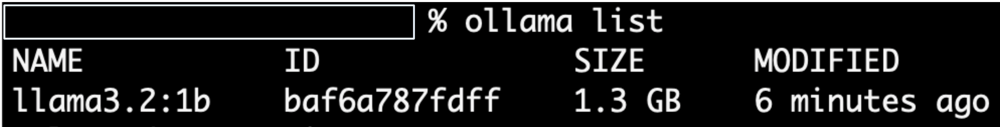
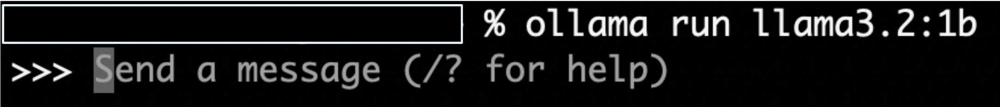
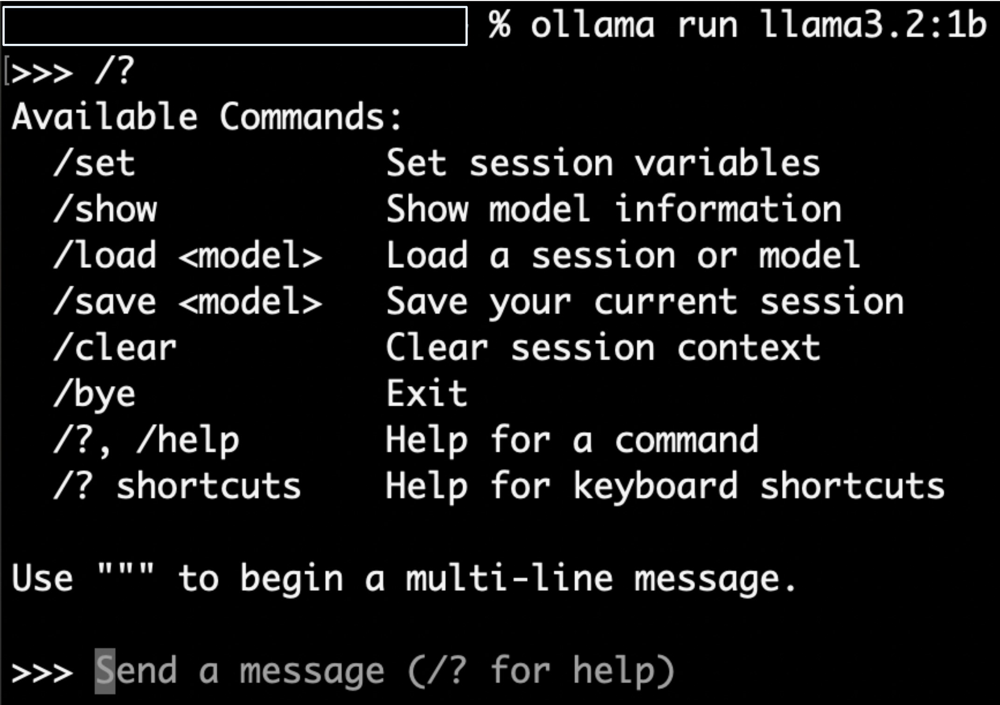
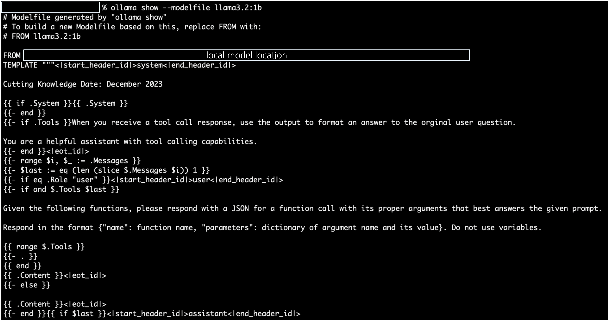

<style>
.custom {
    background-color: #008d8d;
    color: white;
    padding: 0.25em 0.5em 0.25em 0.5em;
    white-space: pre-wrap;       /* css-3 */
    white-space: -moz-pre-wrap;  /* Mozilla, since 1999 */
    white-space: -pre-wrap;      /* Opera 4-6 */
    white-space: -o-pre-wrap;    /* Opera 7 */
    word-wrap: break-word;
}

pre {
    background-color: #027c7c;
    padding-left: 0.5em;
}

</style>

# ChatOllama

- Author: [Ivy Bae](https://github.com/ivybae)
- Peer Review : [HyeonJong Moon](https://github.com/hj0302), [sunworl](https://github.com/sunworl)
- Proofread : [frimer](https://github.com/brian604)
- This is a part of [LangChain Open Tutorial](https://github.com/LangChain-OpenTutorial/LangChain-OpenTutorial)

[](https://colab.research.google.com/github/LangChain-OpenTutorial/LangChain-OpenTutorial/blob/main/04-Model/10-Ollama.ipynb)[](https://github.com/LangChain-OpenTutorial/LangChain-OpenTutorial/blob/main/04-Model/10-Ollama.ipynb)
## Overview

This tutorial covers how ```Ollama``` can be used to run open source large language models, such as Llama 3.3 locally.

- [Ollama Library](https://ollama.com/library) : a list of supperted models

There are two ways to utilize ```Ollama``` models:

- ```ollama``` command in the terminal

- ```ChatOllama``` class of LangChain.

```ChatOllama``` allows you to create a chain of prompt, LLM, OutputParser and run the model like other chat models such as ```ChatOpenAI```.

- The output format can be string, JSON, etc.

- It also supports multimodal models.

### Table of Contents

- [Overview](#overview)
- [Environement Setup](#environment-setup)
- [Install](#install)
- [Model](#model)
- [Output format: JSON](#output-format-json)
- [Multimodal support](#multimodal-support)

### References

- [Ollama](https://ollama.com/)
- [Ollama Model File](https://github.com/ollama/ollama/blob/69f392c9b7ea7c5cc3d46c29774e37fdef51abd8/docs/modelfile.md)
- [ChatOllama](https://python.langchain.com/docs/integrations/chat/ollama/)

---


## Environment Setup

Set up the environment. You may refer to [Environment Setup](https://wikidocs.net/257836) for more details.

**[Note]**

- ```langchain-opentutorial``` is a package that provides a set of easy-to-use environment setup, useful functions and utilities for tutorials.
- You can checkout the [```langchain-opentutorial```](https://github.com/LangChain-OpenTutorial/langchain-opentutorial-pypi) for more details.


```python
%%capture --no-stderr
!pip install langchain-opentutorial
```

```python
# Install required packages
from langchain_opentutorial import package

package.install(
    [
        "langsmith",
        "langchain_core",
        "langchain-ollama",
        "langchain_community",
    ],
    verbose=False,
    upgrade=False,
)
```

<pre class="custom">
    [notice] A new release of pip is available: 24.1 -> 24.3.1
    [notice] To update, run: pip install --upgrade pip
</pre>

```python
# Set environment variables
from langchain_opentutorial import set_env

set_env(
    {
        "LANGCHAIN_API_KEY": "",
        "LANGCHAIN_TRACING_V2": "true",
        "LANGCHAIN_ENDPOINT": "https://api.smith.langchain.com",
        "LANGCHAIN_PROJECT": "09-Ollama",
    }
)
```

<pre class="custom">Environment variables have been set successfully.
</pre>

You can alternatively set API keys such as ```LANGCHAIN_API_KEY``` in a ```.env``` file and load them.

[Note] This is not necessary if you've already set the required API keys in previous steps.


```python
# Load API keys from .env file
from dotenv import load_dotenv

load_dotenv(override=True)
```


<pre class="custom">True</pre>


## Install

Install Ollama and download models we'll use in this tutorial.

### Ollama Download

Download and install Ollama available for macOS, Linux, and Windows.

- [installation](https://ollama.com/)

After installation success, you can run ```ollama``` in your terminal.


### Model Download using Ollama

Above ```ollama``` available commands, the ```pull``` command is used to download a model from a registry and bring it into your local environment.

Use ```ollama pull <name-of-model>``` command to get the model.

For example:

- ```ollama pull llama3.2``` : 3B parameters model (default)

- ```ollama pull llama3.2:1b``` : 1B parameters model

The default tag version of the model will be downloaded to the path below.

- Mac: ```~/.ollama/models```

- Linux/WSL: ```/usr/share/ollama/.ollama/models```

Use ```ollama list``` to view all the models you’ve downloaded.



Chat with model directly from the command line using:

```ollama run <name-of-model>```



Send a message to model and use available commands.




## Model

Check the configuration information in the ```Modelfile``` of the Ollama and run the model with ```ChatOllama```.

### Modelfile

A model file is the blueprint to create and share models with Ollama.

HuggingFace support download open models(.gguf extension). Then you can create a ```Modelfile``` to define your own custom model.

- more information in the [Ollama Modelfile documentation](https://github.com/ollama/ollama/blob/69f392c9b7ea7c5cc3d46c29774e37fdef51abd8/docs/modelfile.md).

In this tutorial, two ways to view ```Modelfile``` of ```llama3.2:1b```.

- Option 1: [view a template from a model's tags page](https://ollama.com/library/llama3.2:1b/blobs/966de95ca8a6)

- Option 2: use ```ollama show``` command to print the ```Modelfile```



You can check the prompt template configuration.


### Ollama model

All local models are available at ```localhost:11434```.


```python
from langchain_ollama import ChatOllama
from langchain_core.output_parsers import StrOutputParser
from langchain_core.prompts import ChatPromptTemplate

llm = ChatOllama(model="llama3.2:1b")

prompt = ChatPromptTemplate.from_template("Provide a brief explanation of this {topic}")

# Chaining
chain = prompt | llm | StrOutputParser()

response = chain.stream({"topic": "deep learning"})
```

```python
from langchain_core.messages import AIMessageChunk

# Streaming response from model
for token in response:
    if isinstance(token, AIMessageChunk):
        print(token.content, end="", flush=True)
    elif isinstance(token, str):
        print(token, end="", flush=True)
```

<pre class="custom">Deep learning is a subfield of machine learning that involves the use of artificial neural networks (ANNs) to analyze and interpret data. ANNs are modeled after the human brain, with layers of interconnected nodes or "neurons" that process and transmit information.
    
    In traditional machine learning, algorithms like linear regression and decision trees are used to solve problems. However, these methods can be inflexible and prone to overfitting, where the model becomes too specialized to the training data and fails to generalize well to new, unseen data.
    
    Deep learning addresses this limitation by using multiple layers of ANNs with different types of nodes (e.g., sigmoid, ReLU, or tanh) that work together to learn complex patterns in the data. The key characteristics of deep learning models include:
    
    1. **Hierarchical structure**: Deep models have multiple layers, each with its own set of nodes and activation functions.
    2. **Non-linearity**: Deep networks use non-linear activation functions, such as ReLU or tanh, which introduce non-linearity into the model.
    3. **Regularization**: Regularization techniques, like dropout or L1/L2 regularization, are used to prevent overfitting by randomly dropping out nodes or adding a penalty term to the loss function.
    
    Deep learning has been widely adopted for tasks such as image recognition, natural language processing, speech recognition, and predictive modeling. It's particularly useful when dealing with high-dimensional data, complex relationships between variables, or noisy data.</pre>

Streaming response is possible through the single chain created above.

- ```astream()``` : asynchronous streaming


```python
async for chunks in chain.astream({"topic": "Google"}):
    print(chunks, end="", flush=True)
```

<pre class="custom">You're referring to Google. Google is an American multinational technology company that specializes in internet-related services and products. It was founded on September 4, 1998, by Larry Page and Sergey Brin while they were Ph.D. students at Stanford University.
    
    Google's primary mission is to organize the world's information and make it universally accessible and useful. The company's search engine, which is now one of the most widely used search engines in the world, was initially designed to provide hyperlinked acronyms (or "knolinks") for Web pages, but over time has evolved into a full-fledged search engine that can index and retrieve information from the entire web.
    
    Google's other notable products and services include:
    
    * Gmail: an email service
    * Google Maps: a mapping and navigation service
    * Google Drive: a cloud storage service
    * Google Docs: a word processing and document editing service
    * YouTube: a video-sharing platform
    * Chrome: a web browser
    
    Google is known for its innovative and user-friendly products, as well as its commitment to improving the online experience. It has become one of the most valuable companies in the world, with a market capitalization of over $1 trillion.</pre>

## Output format: JSON

Use the latest version of Ollama and specify the ```format``` of the output to ```json```.

Local models must be downloaded before they can be used.

- ```ollama pull gemma2```


```python
from langchain_ollama import ChatOllama

llm = ChatOllama(
    model="gemma2",
    format="json",
    temperature=0,
)
```

Output the response in JSON format, even if the prompt does not include a message like ```response in JSON format```.


```python
prompt = "Tell me 10 European travel destinations. key: `places`."

response = llm.invoke(prompt)
print(response.content)
```

<pre class="custom">{
      "places": [
        "Paris, France",
        "Rome, Italy",
        "London, England",
        "Barcelona, Spain",
        "Amsterdam, Netherlands",
        "Prague, Czech Republic",
        "Vienna, Austria",
        "Berlin, Germany",
        "Dublin, Ireland",
        "Budapest, Hungary"
      ]
    }
</pre>

## Multimodal support

Ollama supports multimodal LLMs like [bakllava](https://ollama.com/library/bakllava) and [llava](https://ollama.com/library/llava).

Download multimodal LLMs:

- ```ollama pull llava:7b```

- ```ollama pull bakllava```

Note. update Ollama to use the latest version that supports multimodal.

You can use ```tags``` to explore the full set of versions of models like [llava](https://ollama.com/library/llava/tags).

Provides functions:

- ```convert_to_base64``` : convert a PIL image to a Base64 encoded string

- ```plt_img_base64``` : embed it in HTML to display the image

Example usage:

- Open a PIL image from the specified file path and save it to ```pil_image```.

- Use the ```convert_to_base64``` function to convert ```pil_image``` to a Base64 encoded string.

- Use the ```plt_img_base64``` function to display the Base64-encoded string as an image.


```python
import base64
from io import BytesIO

from IPython.display import HTML, display
from PIL import Image


def convert_to_base64(pil_image):
    buffered = BytesIO()
    pil_image.save(buffered, format="JPEG")
    img_str = base64.b64encode(buffered.getvalue()).decode("utf-8")
    return img_str


def plt_img_base64(img_base64):
    image_html = f''
    display(HTML(image_html))


file_path = "./assets/09-Ollama-flow-explanation-06.png"  # Jeju island beach image
pil_image = Image.open(file_path)

image_b64 = convert_to_base64(pil_image)

plt_img_base64(image_b64)
```


- ```prompt_func``` : takes image and text data as input and converts it to ```HumanMessage```.

  - ```image``` : Base64 encoded JPEG format.

  - ```text``` : plain text.


```python
from langchain_core.messages import HumanMessage


def prompt_func(data):
    text = data["text"]
    image = data["image"]

    image_part = {
        "type": "image_url",
        "image_url": f"data:image/jpeg;base64,{image}",
    }

    content_parts = []

    text_part = {"type": "text", "text": text}

    content_parts.append(image_part)
    content_parts.append(text_part)

    return [HumanMessage(content=content_parts)]
```

Call the ```chain.invoke``` method to pass an image and text query and generate an answer.

- ```ChatOllama``` : Uses a multimodal LLM, such as ```llava```.

- ```StrOutputParser``` : parse the output of LLM into a string

- ```chain``` : pipeline prompt_func, llm, and StrOutputParser


```python
from langchain_core.output_parsers import StrOutputParser
from langchain_ollama import ChatOllama


llm = ChatOllama(model="llava:7b", temperature=0)

chain = prompt_func | llm | StrOutputParser()

query_chain = chain.invoke(
    {"text": "Describe a picture in bullet points", "image": image_b64}
)

print(query_chain)
```

<pre class="custom"> - The image shows a picturesque tropical beach scene.
    - In the foreground, there is a rocky shore with clear blue water and white foam from waves breaking on the rocks.
    - A small island or landmass is visible in the background, surrounded by the ocean.
    - The sky is clear and blue, suggesting good weather conditions.
    - There are no people visible in the image.
    - The overall style of the image is a natural landscape photograph with vibrant colors and clear details. 
</pre>
