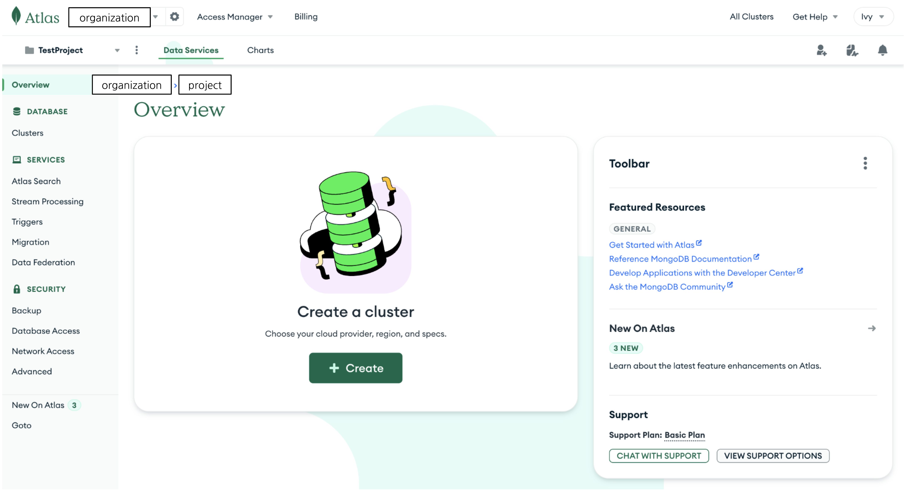
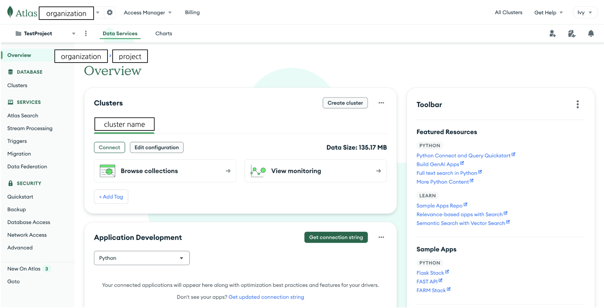
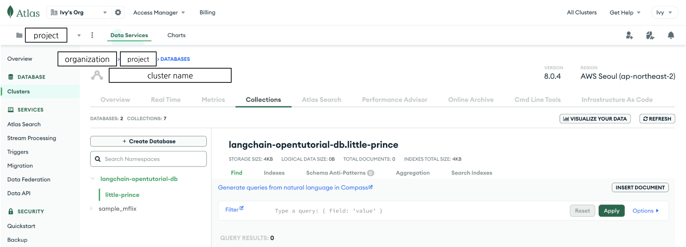
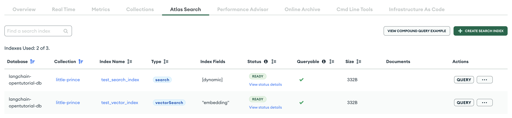
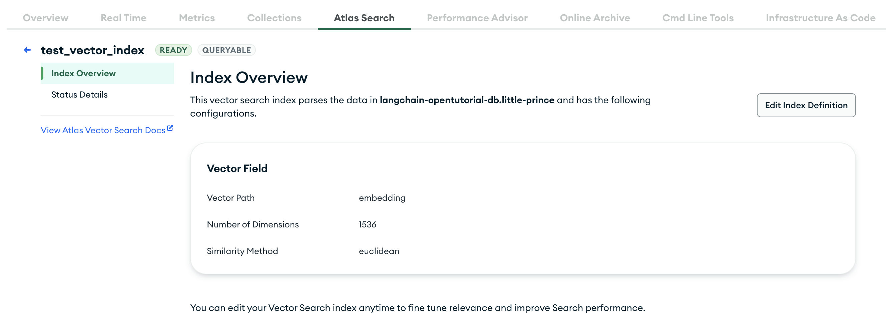
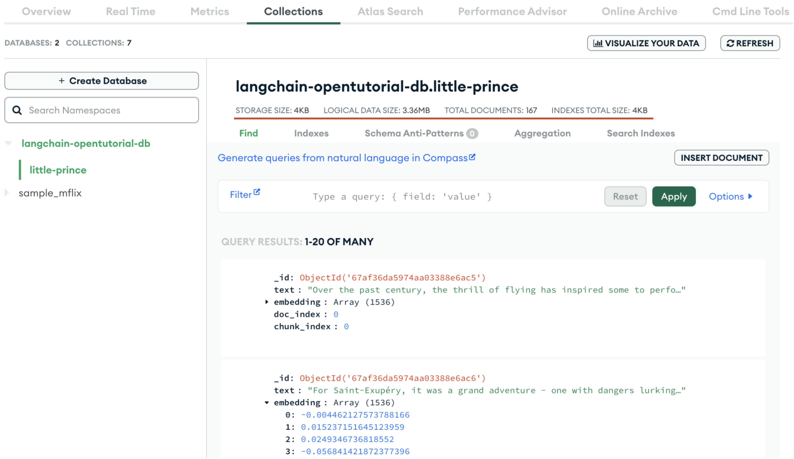
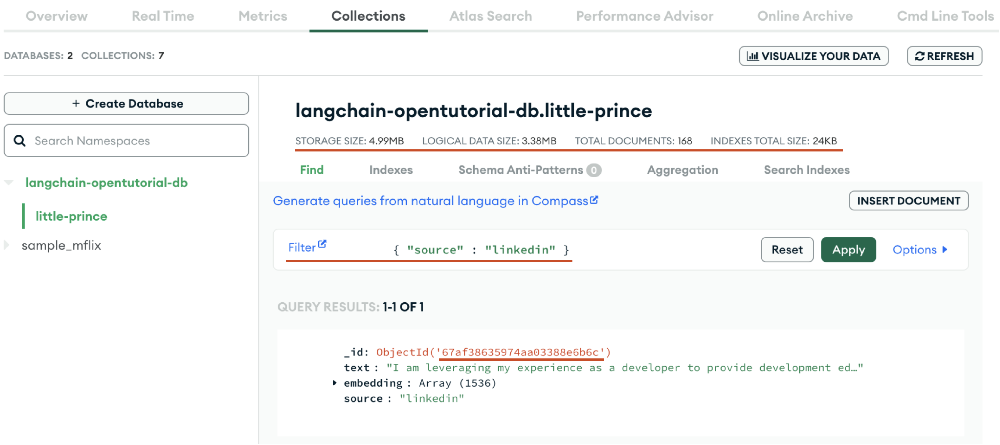
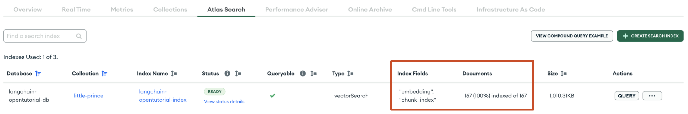

<style>
.custom {
    background-color: #008d8d;
    color: white;
    padding: 0.25em 0.5em 0.25em 0.5em;
    white-space: pre-wrap;       /* css-3 */
    white-space: -moz-pre-wrap;  /* Mozilla, since 1999 */
    white-space: -pre-wrap;      /* Opera 4-6 */
    white-space: -o-pre-wrap;    /* Opera 7 */
    word-wrap: break-word;
}

pre {
    background-color: #027c7c;
    padding-left: 0.5em;
}

</style>

# MongoDB Atlas

- Author: [Ivy Bae](https://github.com/ivybae)
- Peer Review : [Haseom Shin](https://github.com/IHAGI-c), [ro__o_jun](https://github.com/ro-jun)
- This is a part of [LangChain Open Tutorial](https://github.com/LangChain-OpenTutorial/LangChain-OpenTutorial)

[](https://colab.research.google.com/github/LangChain-OpenTutorial/LangChain-OpenTutorial/blob/main/09-VectorStore/07-MongoDB.ipynb) [](https://github.com/LangChain-OpenTutorial/LangChain-OpenTutorial/blob/main/09-VectorStore/07-MongoDB.ipynb)

## Overview

This tutorial covers the initial setup process for users who are new to **MongoDB Atlas**.

If you're already familiar with **MongoDB Atlas**, you can skip the [Initialization](#initialization) section.

All examples run on a free cluster, and once you add a **collection** to your database, you'll be ready to start.

You’ll learn preprocessing to preserve document structure after loading data from a **The Little Prince** file, how to add and delete documents to a **collection**, and manage vector store.

Once the documents added, you can learn how to query your data using **semantic search**, index updates for **filtering**, and **MQL operators**.

By the end of this tutorial, you'll be able to integrate **PyMongo with LangChain** and use VectorStore.

### Table of Contents

- [Overview](#overview)
- [Environement Setup](#environment-setup)
- [Initialization](#initialization)
- [Atlas Vector Search Indexes](#atlas-vector-search-indexes)
- [Vector Store](#vector-store)
- [Load Data](#load-data)
- [Data Preprocessing](#data-preprocessing)
- [Manage vector store](#manage-vector-store)
- [Query vector store](#query-vector-store)
- [CRUD Operations with PyMongo](#crud-operations-with-pymongo)

### References

- [Get Started with Atlas](https://www.mongodb.com/docs/atlas/getting-started/)
- [Deploy a Free Cluster](https://www.mongodb.com/docs/atlas/tutorial/deploy-free-tier-cluster/)
- [Connection Strings](https://www.mongodb.com/docs/manual/reference/connection-string/)
- [Atlas Search and Vector Search Indexes](https://www.mongodb.com/docs/languages/python/pymongo-driver/current/indexes/atlas-search-index/)
- [Review Atlas Search Index Syntax](https://www.mongodb.com/docs/atlas/atlas-search/index-definitions/)
- [JSON and BSON](https://www.mongodb.com/resources/basics/json-and-bson)
- [Write Data to MongoDB](https://www.mongodb.com/docs/languages/python/pymongo-driver/current/write-operations/)
- [Read Data from MongoDB](https://www.mongodb.com/docs/languages/python/pymongo-driver/current/read/)
- [Query Filter Documents](https://www.mongodb.com/docs/manual/core/document/#query-filter-documents)
- [Update Operators](https://www.mongodb.com/docs/manual/reference/operator/update/)
- [Integrate Atlas Vector Search with LangChain](https://www.mongodb.com/docs/atlas/atlas-vector-search/ai-integrations/langchain/)
- [Get Started with the LangChain Integration](https://www.mongodb.com/docs/atlas/atlas-vector-search/ai-integrations/langchain/get-started/)
- [Comparison Query Operators](https://www.mongodb.com/docs/manual/reference/operator/query-comparison/)
- [MongoDB Atlas](https://python.langchain.com/docs/integrations/vectorstores/mongodb_atlas/)
- [Document loaders](https://python.langchain.com/docs/concepts/document_loaders/)
- [Text splitters](https://python.langchain.com/docs/concepts/text_splitters/)

---


## Environment Setup

Set up the environment. You may refer to [Environment Setup](https://wikidocs.net/257836) for more details.

**[Note]**

- `langchain-opentutorial` is a package that provides a set of easy-to-use environment setup, useful functions and utilities for tutorials.
- You can checkout the [`langchain-opentutorial`](https://github.com/LangChain-OpenTutorial/langchain-opentutorial-pypi) for more details.


```python
%%capture --no-stderr
%pip install langchain-opentutorial
```

```python
# Install required packages
from langchain_opentutorial import package

package.install(
    [
        "langchain_openai",
        "langsmith",
        "langchain_core",
        "langchain_community",
        "langchain-mongodb",
        "pymongo",
        "certifi",
    ],
    verbose=False,
    upgrade=False,
)
```

<pre class="custom">
    [notice] A new release of pip is available: 24.1 -> 25.0.1
    [notice] To update, run: pip install --upgrade pip
</pre>

```python
# Set environment variables
from langchain_opentutorial import set_env

set_env(
    {
        "OPENAI_API_KEY": "",
        "LANGCHAIN_API_KEY": "",
        "MONGODB_ATLAS_CLUSTER_URI": "",
        "LANGCHAIN_TRACING_V2": "true",
        "LANGCHAIN_ENDPOINT": "https://api.smith.langchain.com",
        "LANGCHAIN_PROJECT": "07-MongoDB-Atlas",
    }
)
```

<pre class="custom">Environment variables have been set successfully.
</pre>

You can alternatively set API keys such as `OPENAI_API_KEY` in a `.env` file and load them.

[Note] This is not necessary if you've already set the required API keys in previous steps.

`MONGODB_ATLAS_CLUSTER_URI` is required to use **MongoDB Atlas** and is explained in the [Connect to your cluster](#connect-to-your-cluster).

If you are already using **MongoDB Atlas**, you can set the cluster **connection string** to `MONGODB_ATLAS_CLUSTER_URI` in your `.env` file.


```python
# Load API keys from .env file
from dotenv import load_dotenv

load_dotenv(override=True)
```


<pre class="custom">True</pre>


## Initialization

[MongoDB Atlas](https://www.mongodb.com/en/atlas) is a multi-cloud database service that provides an easy way to host and manage your data in the cloud.

After you register with and log in to **Atlas**, you can create a Free cluster.

**Atlas** can be started with [Atlas CLI](https://www.mongodb.com/docs/atlas/cli/current/atlas-cli-getting-started/) or **Atlas UI**.

**Atlas CLI** can be difficult to use if you're not used to working with development tools, so this tutorial will walk you through how to use **Atlas UI**.

### Deploy a cluster

Please select the appropriate project in your **Organization**. If the project doesn't exist, you'll need to create it.

If you select a project, you can create a cluster.



Follow the procedure below to deploy a cluster

- select **Cluster**: **M0** Free cluster option

> Note: You can deploy only one Free cluster per Atlas project

- select **Provider**: **M0** on AWS, GCP, and Azure

- select **Region**

- create a database user and add your IP address settings.

After you deploy a cluster, you can see the cluster you deployed as shown in the image below.




### Connect to your cluster

Click **Get connection string** in the image above to get the cluster URI and set the value of `MONGODB_ATLAS_CLUSTER_URI` in the `.env` file.

The **connection string** resembles the following example:

> mongodb+srv://[databaseUser]:[databasePassword]@[clusterName].[hostName].mongodb.net/?retryWrites=true&w=majority

Then go back to the [Environment Setup](#environment-setup) and run the `load_dotenv` function again.


## Initialize MongoDBAtlas and MongoDBAtlasDocumentManager

`MongoDBAtlas` manages MongoDB collections and vector store.

- Internally, it connects to the cluster using [PyMongo](https://github.com/mongodb/mongo-python-driver), the MongoDB python driver.

- You can also create a vector store that integrates Atlas Vector Search and Langchain.

`MongoDBAtlasDocumentManager` that handles document processing and CRUD operations in MongoDB Atlas.

### Initialize MongoDB database and collection

- A **MongoDB database** stores a collections of documents.


```python
from utils.mongodb_atlas import MongoDBAtlas, MongoDBAtlasDocumentManager

DB_NAME = "langchain-opentutorial-db"
COLLECTION_NAME = "little-prince"

atlas = MongoDBAtlas(DB_NAME, COLLECTION_NAME)
document_manager = MongoDBAtlasDocumentManager(atlas=atlas)
```

You can **browse collections** to see the **little-prince** collection you just created and the sample data provided by Atlas.

- [available sample datasets](https://www.mongodb.com/docs/atlas/sample-data/#std-label-available-sample-datasets)



In this tutorial, we will use the **little-prince** collection in the **langchain-opentutorial-db** database.


## Atlas Vector Search Indexes

When performing vector search in Atlas, you must create an **Atlas Vector Search Index**.


### Create a Search Index or Vector Search Index

You can define **Atlas Search Index** or **Atlas Vector Search Index** using `SearchIndexModel` object.

- `definition` : define the **Search Index**.

- `name` : query the **Search Index** by name.

To learn more about `definition` of `SearchIndexModel` , see [Review Atlas Search Index Syntax](https://www.mongodb.com/docs/atlas/atlas-search/index-definitions/).


```python
from pymongo.operations import SearchIndexModel

TEST_SEARCH_INDEX_NAME = "test_search_index"
TEST_VECTOR_SEARCH_INDEX_NAME = "test_vector_index"

search_index = SearchIndexModel(
    definition={
        "mappings": {"dynamic": True},
    },
    name=TEST_SEARCH_INDEX_NAME,
)

vector_index = SearchIndexModel(
    definition={
        "fields": [
            {
                "type": "vector",
                "numDimensions": 1536,
                "path": "embedding",
                "similarity": "cosine",
            }
        ]
    },
    name=TEST_VECTOR_SEARCH_INDEX_NAME,
    type="vectorSearch",
)
```

- `create_index` : create a single **Atlas Search Index** or **Atlas Vector Search Index**. Checks internally if a **Search Index** with the same name exists.


```python
atlas.create_index(TEST_SEARCH_INDEX_NAME, search_index)
atlas.create_index(TEST_VECTOR_SEARCH_INDEX_NAME, vector_index)
```

Click the **Atlas Search tab** to see the search indexes that you created.




### Update a Search Index

- `update_index` : update an **Atlas Search Index** or **Atlas Vector Search Index**.


```python
new_vector_index = {
    "fields": [
        {
            "type": "vector",
            "numDimensions": 1536,
            "path": "embedding",
            "similarity": "euclidean",
        }
    ]
}

atlas.update_index(TEST_VECTOR_SEARCH_INDEX_NAME, definition=new_vector_index)
```

If the update is successful, click **test_vector_index** in the list of **Index Name** on the **Atlas Search tab** to see more information.

You can see that the **Similarity Method** for the **Vector Field** has changed to **euclidean**.



You can also click the **Edit Index Definition** button on the right side of the **Atlas UI** to update it.


### Delete a Search Index

- `delete_index` : remove an **Atlas Search Index** or **Atlas Vector Search Index**.


```python
atlas.delete_index(TEST_SEARCH_INDEX_NAME)
atlas.delete_index(TEST_VECTOR_SEARCH_INDEX_NAME)
```

## Vector Store

- `create_vector_store` : create a vector store using `MongoDBAtlasVectorSearch` .

  - `embedding` : embedding model to use.

  - `index_name` : index to use when querying the vector store.

  - `relevance_score_fn` : similarity score used for the index. You can choose from euclidean, cosine, and dotProduct.


```python
from langchain_openai import OpenAIEmbeddings

embedding = OpenAIEmbeddings(model="text-embedding-3-small")
TUTORIAL_VECTOR_SEARCH_INDEX_NAME = "langchain-opentutorial-index"

atlas.create_vector_store(
    embedding=embedding,
    index_name=TUTORIAL_VECTOR_SEARCH_INDEX_NAME,
    relevance_score_fn="cosine",
)
```

### Create a Index

- `create_vector_search_index` : Alternative to the above [Create a Search Index or Vector Search Index](#create-a-search-index-or-vector-search-index) section that creates a Vector Search Index.


```python
atlas.create_vector_search_index(dimensions=1536)
```

Click the **Atlas Search tab** to see the search index **langchain-opentutorial-index** that you created.


## Load Data

LangChain provides **Document loaders** that can load a variety of data sources.

### Document loaders

- `get_documents` : use `TextLoader` to add data from the **the_little_prince.txt** in the data directory to the **little-prince** collection.


```python
documents = document_manager.get_documents(
    file_path="./data/the_little_prince.txt", encoding="utf-8"
)
```

The `get_documents` method returns **List[Document]**.

- `metadata` : data associated with content

- `page_content` : string text


## Data Preprocessing

### Preserving text file structure

In the [Document loaders](#document-loaders) section above, `page_content` has all the text in the file assigned to it.

- `split_by_chapter`

  - To preserve the structure of the text file, let's modify it to **split the file into chapters.**

  - **the_little_prince.txt** used **[ Chapter X ]** as a delimiter to separate the chapters.


```python
from typing import List


def split_by_chapter(text: str) -> List[str]:
    chapters = text.split("[ Chapter ")
    return [chapter.split(" ]", 1)[-1].strip() for chapter in chapters]
```

- `split_documents` : split documents by **chapter**

  - Add `doc_index` to metadata


```python
split_chapters = document_manager.split_documents(
    documents, split_condition=split_by_chapter, split_index_name="doc_index"
)
```

If you compare the `documents` to `split_chapters` , you can see that `page_content` is split by `chapter` .


```python
first_chapter = split_chapters[1]
print(f"{first_chapter.page_content[:30]}, metadata: {first_chapter.metadata}")
```

<pre class="custom">- we are introduced to the nar, metadata: {'doc_index': 1}
</pre>

### Text splitters

Splitting a `Document` into appropriately sized chunks allows you to process text data more efficiently.

To split a `Document` while preserving paragraph and sentence structure, use `RecursiveCharacterTextSplitter` .

- `chunk_size` : setting the maximum size of chunks

- `chunk_overlap` : setting the character overlap size between chunks


```python
from langchain_text_splitters import RecursiveCharacterTextSplitter

text_splitter = RecursiveCharacterTextSplitter(chunk_size=800, chunk_overlap=200)
split_documents = document_manager.split_documents_by_splitter(
    text_splitter, split_chapters
)
```

### Add metadata

Splitting the document into `chunk_size` increases the number of documents.

Add an `chunk_index` key to the metadata to identify the document index, since it is not split into one `Document` per chapter.


```python
for index, doc in enumerate(split_documents):
    doc.metadata.update({"chunk_index": index})
```

The `chunk_index` has been added to the metadata.

You can see that some of the `page_content` text in the `Document` overlaps.


## Manage vector store

Now that you've initialized the `vector_store` and loaded the data, you can add and delete **Documents** to the **little-prince** collection.

### Add

- `add_documents` : Add **documents** to the `vector_store` and returns a List of IDs for the added documents.


```python
ids = atlas.add_documents(documents=split_documents)
```

`delete` function allow specify the Document IDs to delete, so `ids` store the IDs of the added documents.

Check the first document ID. The number of **IDs** matches the number of **documents**, and each ID is a unique value.

In the image below, after adding **documents** the **STORAGE SIZE** of the collection increases and you can see the documents corresponding to each ID, such as `ids[0]` .



The `embedding` field is a **vector representation of the text** data. It is used to determine similarity to the query vector for vector search.


### Query Filter

Create a `Document` object, add it to a **collection**.


```python
from langchain_core.documents import Document

sample_document = Document(
    page_content="I am leveraging my experience as a developer to provide development education and nurture many new developers.",
    metadata={"source": "linkedin"},
)
sample_id = atlas.add_documents([sample_document])
```

**TOTAL DOCUMENTS** has increased from 167 to 168.

On the last page, you can see the `page_content` of `sample_document` .

Alternatively, you can add **query filter**, such as the `source` field, to view the search results.




### Delete

You can specify the **document IDs to delete** as arguments to the `delete_documents` function, such as `sample_id` .


```python
atlas.delete_documents(ids=sample_id)
```


<pre class="custom">True</pre>


If `True` returns, the deletion is successful.

You can see that **TOTAL DOCUMENTS** has decreasesd from 168 to 167 and that `sample_document` has been deleted.


## Query vector store

Make a `query` related to the content of The Little Prince and see if the `vector_store` returns results from a search for similar documents.

The `query` is based on the most well-known story about the relationship between the Little Prince and the Fox.


```python
query = "What does it mean to be tamed according to the fox?"
```

### Semantic Search

`similarity_search` method performs a basic semantic search

The `k` parameter in the example below specifies the number of documents.

It returns a **List[Document]** ranked by relevance.


```python
atlas.similarity_search(query=query, k=1)
```


<pre class="custom">[Document(metadata={'_id': '67b07b9602e46738df0bbb2e', 'doc_index': 21, 'chunk_index': 122}, page_content='The fox gazed at the little prince, for a long time. \n(picture)\n"Please-- tame me!" he said. \n"I want to, very much," the little prince replied. "But I have not much time. I have friends to discover, and a great many things to understand." \n"One only understands the things that one tames," said the fox. "Men have no more time to understand anything. They buy things all ready made at the shops. But there is no shop anywhere where one can buy friendship, and so men have no friends any more. If you want a friend, tame me..." \n"What must I do, to tame you?" asked the little prince.')]</pre>


### Semantic Search with Score

`similarity_search_with_score` method also performs a semantic search.

The difference with the `similarity_search` method is that it returns a **relevance score** of documents between 0 and 1.


```python
atlas.similarity_search_with_score(query=query, k=3)
```


<pre class="custom">[(Document(metadata={'_id': '67b07b9602e46738df0bbb2e', 'doc_index': 21, 'chunk_index': 122}, page_content='The fox gazed at the little prince, for a long time. \n(picture)\n"Please-- tame me!" he said. \n"I want to, very much," the little prince replied. "But I have not much time. I have friends to discover, and a great many things to understand." \n"One only understands the things that one tames," said the fox. "Men have no more time to understand anything. They buy things all ready made at the shops. But there is no shop anywhere where one can buy friendship, and so men have no friends any more. If you want a friend, tame me..." \n"What must I do, to tame you?" asked the little prince.'),
      0.8047155141830444),
     (Document(metadata={'_id': '67b07b9602e46738df0bbb2a', 'doc_index': 21, 'chunk_index': 118}, page_content='"No," said the little prince. "I am looking for friends. What does that mean-- ‘tame‘?" \n"It is an act too often neglected," said the fox. It means to establish ties." \n"\'To establish ties\'?"\n"Just that," said the fox. "To me, you are still nothing more than a little boy who is just like a hundred thousand other little boys. And I have no need of you. And you, on your part, have no need of me. To you, I am nothing more than a fox like a hundred thousand other foxes. But if you tame me, then we shall need each other. To me, you will be unique in all the world. To you, I shall be unique in all the world..." \n"I am beginning to understand," said the little prince. "There is a flower... I think that she has tamed me..."'),
      0.7951536178588867),
     (Document(metadata={'_id': '67b07b9602e46738df0bbb29', 'doc_index': 21, 'chunk_index': 117}, page_content='"What does that mean-- ‘tame‘?" \n"You do not live here," said the fox. "What is it that you are looking for?" \n"I am looking for men," said the little prince. "What does that mean-- ‘tame‘?" \n"Men," said the fox. "They have guns, and they hunt. It is very disturbing. They also raise chickens. These are their only interests. Are you looking for chickens?" \n"No," said the little prince. "I am looking for friends. What does that mean-- ‘tame‘?" \n"It is an act too often neglected," said the fox. It means to establish ties." \n"\'To establish ties\'?"'),
      0.7918769717216492)]</pre>


### Semantic Search with Filtering

**MongoDB Atlas** supports pre-filtering your data using **MongoDB Query Language(MQL) Operators**.

You must update the index definition using `update_vector_search_index` .


```python
atlas.update_vector_search_index(dimensions=1536, filters=["chunk_index"])
```

Compare the image below to when you first created the index in [Vector Store](#vector-store).

Notice that `chunk_index` have been added to the **Index Fields** and **Documents** have been added as well.




There are **comparison query operators** that find values that match a condition.

For example, the `$eq` operator finds **documents** that match a specified value.

Now you can add a `pre_filter` condition that documents **chunk_index** are lower than or equal to 120 using the `$lte` operator.


```python
atlas.similarity_search_with_score(
    query=query, k=3, pre_filter={"chunk_index": {"$lte": 120}}
)
```


<pre class="custom">[(Document(metadata={'_id': '67b07b9602e46738df0bbb2a', 'doc_index': 21, 'chunk_index': 118}, page_content='"No," said the little prince. "I am looking for friends. What does that mean-- ‘tame‘?" \n"It is an act too often neglected," said the fox. It means to establish ties." \n"\'To establish ties\'?"\n"Just that," said the fox. "To me, you are still nothing more than a little boy who is just like a hundred thousand other little boys. And I have no need of you. And you, on your part, have no need of me. To you, I am nothing more than a fox like a hundred thousand other foxes. But if you tame me, then we shall need each other. To me, you will be unique in all the world. To you, I shall be unique in all the world..." \n"I am beginning to understand," said the little prince. "There is a flower... I think that she has tamed me..."'),
      0.7951536178588867),
     (Document(metadata={'_id': '67b07b9602e46738df0bbb29', 'doc_index': 21, 'chunk_index': 117}, page_content='"What does that mean-- ‘tame‘?" \n"You do not live here," said the fox. "What is it that you are looking for?" \n"I am looking for men," said the little prince. "What does that mean-- ‘tame‘?" \n"Men," said the fox. "They have guns, and they hunt. It is very disturbing. They also raise chickens. These are their only interests. Are you looking for chickens?" \n"No," said the little prince. "I am looking for friends. What does that mean-- ‘tame‘?" \n"It is an act too often neglected," said the fox. It means to establish ties." \n"\'To establish ties\'?"'),
      0.7918769717216492),
     (Document(metadata={'_id': '67b07b9602e46738df0bbb2c', 'doc_index': 21, 'chunk_index': 120}, page_content='"My life is very monotonous," the fox said. "I hunt chickens; men hunt me. All the chickens are just alike, and all the men are just alike. And, in consequence, I am a little bored. But if you tame me, it will be as if the sun came to shine on my life . I shall know the sound of a step that will be different from all the others. Other steps send me hurrying back underneath the ground. Yours will call me, like music, out of my burrow. And then look: you see the grain-fields down yonder? I do not ea t bread. Wheat is of no use to me. The wheat fields have nothing to say to me. And that is sad. But you have hair that is the colour of gold. Think how wonderful that will be when you have tamed me! The grain, which is also golden, will bring me bac k the thought of you. And I shall love to'),
      0.7739419937133789)]</pre>


## CRUD Operations with PyMongo

Let's use **PyMongo Collection** instead of `MongoDBAtlasVectorSearch` for our **Document CRUD Operations**.

### Setting up with an empty collection

Delete all documents in `vector_store` and start with an empty collection.

- `delete_documents` : If you don't specify an ID, all documents added to the collection are deleted.


```python
atlas.delete_documents()
```


<pre class="custom">True</pre>


If `True` returns, the deletion is successful.

You can see that **TOTAL DOCUMENTS** has decreasesd to 0.


### Upsert

Splits a list of documents into `page_content` and `metadata` , then upsert them.

- `upsert_parallel` : update documents that match the filter or insert new documents.

Internally, `Document` is converted to `RawBSONDocument` .

- `RawBSONDocument` : represent BSON document using the raw bytes.
  - BSON, the binary representation of JSON, is primarily used internally by MongoDB.


```python
texts, metadatas = zip(*[(doc.page_content, doc.metadata) for doc in split_documents])
document_manager.upsert_parallel(texts=texts, metadatas=list(metadatas))
```

### Read with Evaluation Operators

To compare the equality, use `<field>` : `<value>` expression .

You can also use [evaluation operators](https://www.mongodb.com/docs/languages/python/pymongo-driver/current/read/specify-a-query/#evaluation-operators) to perform operations.

For example, `$regex` operator returns documents that match a regular expression.

- `fox_query_filter` : find all documents inclues the string `fox` in the `page_content` field.

- `find_one_by_filter` : retrieve the first document that matches the condition.


```python
fox_query_filter = {"page_content": {"$regex": "fox"}}

find_result = document_manager.find_one_by_filter(filter=fox_query_filter)
print(find_result["page_content"])
```

<pre class="custom">- the little prince befriends the fox
    It was then that the fox appeared.
    "Good morning," said the fox. 
    "Good morning," the little prince responded politely, although when he turned around he saw nothing. 
    "I am right here," the voice said, "under the apple tree." 
    (picture)
    "Who are you?" asked the little prince, and added, "You are very pretty to look at." 
    "I am a fox," said the fox. 
    "Come and play with me," proposed the little prince. "I am so unhappy." 
    "I cannot play with you," the fox said. "I am not tamed." 
    "Ah! Please excuse me," said the little prince. 
    But, after some thought, he added: 
    "What does that mean-- ‘tame‘?" 
    "You do not live here," said the fox. "What is it that you are looking for?" 
    "I am looking for men," said the little prince. "What does that mean-- ‘tame‘?"
</pre>

- `find` : find all documents that match the condition. Passing an empty filter will return all documents.


```python
cursor = document_manager.find(filter=fox_query_filter)

fox_story_documents = []
for doc in cursor:
    fox_story_documents.append(doc)
len(fox_story_documents)
```


<pre class="custom">19</pre>


### Update with query filter

You can use [update operators](https://www.mongodb.com/docs/manual/reference/operator/update/) to perform operations.

For example, `$set` operator sets the value of a field in a document.

- `preface_query_filter` : find all documents with the value `0` in the `metadata.doc_index` field.

- `update_operation` : updates `0` in the document's `metadata.doc_index` to `-1` .


```python
preface_query_filter = {"metadata.doc_index": 0}
update_operation = {"$set": {"metadata.doc_index": -1}}
```

- `update_one_by_filter` : updates the first document that matches the condition.

- `update_many_by_filter` : updates all documents that match the condition.


```python
updateOneResult = document_manager.update_one_by_filter(
    preface_query_filter, update_operation
)
updateManyResult = document_manager.update_many_by_filter(
    preface_query_filter, update_operation
)
```

`update_one` and `update_many` return `UpdateResult` object that contains the properties below:

- `matched_count` : The number of documents that matched the query filter.

- `modified_count` : The number of documents modified.


```python
print(
    f"matched: {updateOneResult.matched_count}, modified: {updateOneResult.modified_count}"
)
print(
    f"matched: {updateManyResult.matched_count}, modified: {updateManyResult.modified_count}"
)
```

<pre class="custom">matched: 1, modified: 1
    matched: 5, modified: 5
</pre>

### Upsert option

If you set the `upsert` to `True` in update operation, inserts a new document if no document matches the query filter.

- `source_query_filter` : find all documents with the value `facebook` in the `metadata.source` field.

- `upsert_operation` : updates `facebook` in the document's `metadata.source` to `book` .


```python
source_query_filter = {"metadata.source": "facebook"}
upsert_operation = {"$set": {"metadata.source": "book"}}
upsertResult = document_manager.upsert_many_by_filter(
    source_query_filter, upsert_operation
)
print(
    f"matched: {upsertResult.matched_count}, modified: {upsertResult.modified_count}, upserted_id: {upsertResult.upserted_id}"
)
```

<pre class="custom">matched: 0, modified: 0, upserted_id: 67b07ce6fbff5980ceb32fa2
</pre>

### Delete with query filter

- `delete_one_by_filter` : deletes the first document that matches the condition and returns `DeleteResult` object.

- `deleted_count` : The number of documents deleted.


```python
deleteOneResult = document_manager.delete_one_by_filter(
    fox_query_filter, comment="Deleting the first document containing fox"
)

print(f"deleted: {deleteOneResult.deleted_count}")
```

<pre class="custom">deleted: 1
</pre>

- `delete` : deletes all documents that match the condition.


```python
document_manager.delete(filters=fox_query_filter)
```
